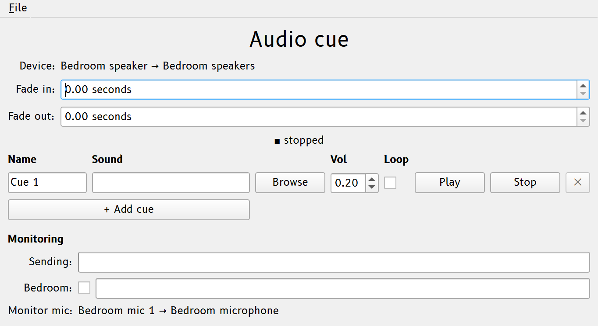
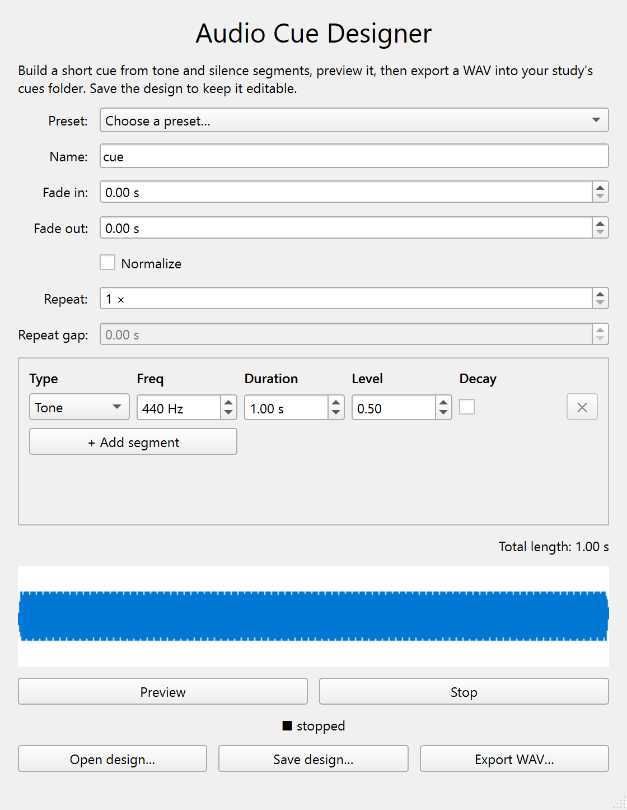

# Audio cues

Audio is SMACC's primary cueing modality. The **Audio cue** window (in the
**Panels** column) holds the cue board: one row per cue, each ready to fire with a
single click.

{width=75% fig-alt="The Audio cue window: a cue row with its volume and loop controls, and the Monitoring section below."}

## The cue board

Place sound files where your settings expect them — by default the data directory's
`cues/` folder (for example `~/SMACC/data/cues/`; common formats such as `.wav`,
`.mp3`, `.flac`, `.ogg`, and `.aiff` are accepted) — and trigger them from the cue
controls. SMACC seeds a few `demo-*` cues there so there is always something to test
with. You start with one cue, prefilled with a random demo, and use **+ Add cue** and
each row's **✕** to match a protocol (one minimum, up to 20).

Each play and stop is marked in the EEG record. The cue marker is stamped at the
*estimated sound onset*, not the button press, so it lines up with what the
participant hears (see [Volume & latency](latency.md)).

## Designing a cue

No sound file ready? Open the **Audio Cue Designer** from the Launcher to build a
simple cue inside SMACC, with no external audio editor. Lay out a sequence of
**tone** and **silence** segments (each tone has a frequency, duration, and level,
with an optional bell-like **decay**), or start from a **preset** (a single chime, a
pip train). The whole pattern can **repeat** (×N with a gap between repeats, the
classic pip-train shape), and an optional whole-cue fade in/out and normalize finish
it. A live **waveform** shows the cue as you edit, **Preview** plays it on your
default output, and **Export WAV…** writes it into your study's `cues/` folder, where
it appears in the cue board like any other cue.

The WAV is what the cue board plays; the *design* stays editable through **Save
design… / Open design…** (a small `.json` file, kept alongside the WAVs by default),
so you can reopen it tomorrow and nudge a level instead of rebuilding the cue. The
designer is a standalone tool: it plays on the default device and ignores the
session's device routing and volume safety cap.

{width=75% fig-alt="The Audio Cue Designer: tone and silence segments above a live waveform, with the Preview and Export WAV… buttons."}

## Background noise

The **Noise machine** window plays continuous masking noise on the cue route. Pick a
**color** (white and the other generated colours) or point it at your own WAV
(the **From file** option), set its **volume**, and start it. **Noise started** (62) and
**Noise stopped** (63) mark the EEG. Noise shares the bedroom-speaker route and the
output safety cap with cues, so calibrate it the same way.

## Is the cue reaching the bedroom?

A cue you can hear in the control room is not proof the *participant* heard it: the
bedroom speaker could be muted, unplugged, or turned down at the hardware. The Audio
cue window's **Monitoring** section shows two meters so you can tell:

- **Sending** is the level SMACC is emitting to the cue output, the moment it plays.
    It is exact, but it only confirms SMACC is *playing*; it is blind to everything
    downstream (Windows volume, the speaker's power switch, the cable). Read it as a
    diagnostic: if *Sending* is dark, the problem is on SMACC's side (wrong cue, or a
    per-cue volume or the safety cap at zero); if it is lit but the room is silent,
    the problem is the speaker.
- **Bedroom** is the level a microphone actually picks up in the room. This is the
    objective check: it moves only when sound really happens in the bedroom. Tick the
    box beside it to start monitoring. Because a faint cue can sit close to a cheap
    mic's noise floor, the meter also shows the **rise above the room's resting
    level** (the `+N` next to the reading), so even a small bump stands out.

::: {.callout-tip title="A dedicated monitoring mic"}

The *Bedroom* meter listens on the **Monitor bedroom noise** route, which
defaults to **Bedroom mic 1**. For the most reliable check — especially for the
very quiet cues a study often starts at — bind a separate, sensitive **Bedroom
mic 2** in the Devices window and route *Monitor bedroom noise* to it. That keeps
verification independent of the (often cheaper, voice-activated) dream-report mic.

:::

::: {.callout-warning title="A quiet mic isn't proof of silence"}

A cheap or voice-activated mic may not register a very faint cue even when it is
playing, so a dark *Bedroom* meter is a prompt to check, not proof the cue failed.
Read it together with *Sending*.

:::

For how cue levels combine and how to calibrate them, see
[Volume & latency](latency.md). For binding the speaker and mics, see
[Audio routing](audio.md).
