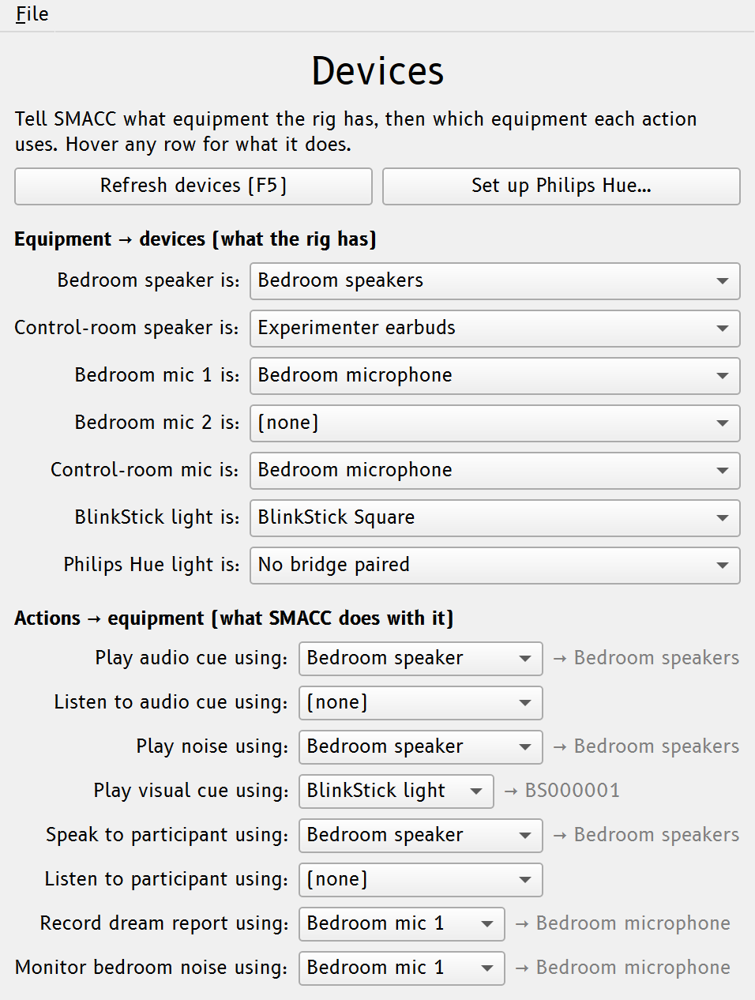

# Audio routing {#chap-audio}

An overnight cueing study can run several audio streams at once: a cue in the
bedroom, white noise in the bedroom, your voice over an intercom, the participant's
voice coming back, a dream-report mic, and sometimes a [light cue](visual.md#chap-visual). These often span
more than one physical device and two rooms. On Windows, the same speaker can also
appear under several names, and the level that reaches the participant is the product
of several controls spread across the OS.

This chapter describes how SMACC handles devices and routing. For the output safety cap
and stimulus timing, see [Volume & latency](latency.md#chap-latency).

## Equipment and actions

Instead of picking a device separately in every window, SMACC has one **Devices
window** (in the **Panels** column) where you do two things:

1. **Bind each piece of _equipment_ to a device, once.** Equipment entries are
   the physical endpoints of a rig, named by place: **Bedroom speaker**, **Control-room speaker**, **Bedroom
   mic 1** (and an optional **Bedroom mic 2**), the **Control-room mic** (the
   experimenter's intercom voice), plus the light devices (**BlinkStick light**,
   **Philips Hue light**).
1. **Route each _action_ to equipment.** Every action names what SMACC does
   with a device — *Play audio cue*, *Record dream report* — and each points
   at a piece of equipment. Hover any row in the window for a full description.

The cue, the noise, and your intercom voice can all share the **Bedroom
speaker**, so swapping it is one change rather than several. Every other
window shows a read-only indicator of where it resolves, for example
`Device: Bedroom speaker → Speakers (USB Audio)`, and the Devices window shows the
same resolution beside each route — a route pointed at equipment with nothing
bound reads **→ no device** instead of looking configured.

{#fig-devices width=75% fig-alt="The Devices window: the Equipment → devices bindings on top, the Actions → equipment routes below, each showing the device it resolves to."}

```text
Bedroom speaker       Speakers (USB Audio)
Control-room speaker  Headphones (Realtek)
Bedroom mic 1         Microphone (USB Audio)
──────────────────────────────────────────
Play audio cue       → Bedroom speaker    (listen: Control-room speaker)
Play noise           → Bedroom speaker
Speak to participant → Bedroom speaker
Record dream report  → Bedroom mic 1
```

The whole assignment is saved in your SMACC file, so a rig travels with
its study. If a bound device isn't connected when a study loads, SMACC keeps going
and reports which one is missing instead of silently falling back.

### No "system default"

SMACC never routes audio to "whatever the system default is". Windows reassigns
its default device on its own — plugging in an HDMI monitor or a Bluetooth headset
is enough — and an overnight study must not follow it. Instead:

- When a session starts (or loads a study) with nothing bound to the **Bedroom
  speaker**, **Bedroom mic 1**, or the **Control-room mic**, SMACC binds the device
  that is *currently* the Windows default — explicitly, by name — and logs which
  one it picked. From then on the binding is pinned: changing the Windows default
  never re-routes a study.
- Equipment with nothing bound reads **(none)**, and anything routed to it
  reports a clear error instead of quietly playing somewhere else.
- If no device is connected at all, the dropdown says so (e.g. **No output device
  found**) rather than offering an empty choice.
- A bound device that isn't currently connected shows as **(not connected)** and
  is kept — never silently swapped — until you pick another device or plug it back
  in (then **Refresh devices (F5)**).

The study editor never auto-binds: a study built on an office machine arrives at
the rig with its equipment unbound, and the rig pins its own defaults on first
load.

### Monitoring routes

Three optional routes cover the things you reach for mid-study:

- **Listen to audio cue (fan-out).** Route *Listen to audio cue* to the
  control-room speaker and each cue plays in the bedroom and the control room at
  once, so you hear what the participant hears.
- **Listen to participant.** The intercom is two-way: **Speak to participant**
  sends your voice — picked up by the **Control-room mic** — to the participant
  (and is marked in the EEG record), while **Listen to participant** brings the
  participant's mic to your control-room speaker. The intercom also has a typed
  [text-chat mode](intercom.md#text-chat) (no audio device involved) for
  hearing-impaired participants.
- **Monitor bedroom noise.** A microphone meter in the Audio cue window that
  confirms a cue is audible in the bedroom (see
  [Audio cues](audio-cues.md#is-the-cue-reaching-the-bedroom)). It defaults to
  **Bedroom mic 1**, or bind a dedicated, more sensitive **Bedroom mic 2** and route
  *Monitor bedroom noise* to it.

## One audio engine

All real-time audio (cues, noise, the intercom, the dream-report recorder, and the
input-level meter) runs on [`sounddevice`](https://python-sounddevice.readthedocs.io/)
(PortAudio), through the **Windows WASAPI** host API.

::: {.callout-note title="Why WASAPI"}

On Windows, PortAudio lists every speaker once per host API (MME, DirectSound,
WASAPI, WDM-KS), which is where the "same device, several names" confusion comes
from, and the legacy MME names are truncated to 31 characters. SMACC enumerates
only WASAPI, so each device appears once, with its full name, on the modern
low-latency path.

:::

::: {.callout-note title="Device names in the Devices window"}

Because SMACC enumerates only WASAPI devices, it drops the redundant
", Windows WASAPI" suffix that PortAudio appends to each device name. With only
one host API in the list, the suffix added nothing, so a device reads as
`Speakers (USB Audio)` rather than `Speakers (USB Audio), Windows WASAPI`.

:::

Because everything shares one engine, device names mean the same thing everywhere,
and sending one cue to two devices at once (the fan-out) is two streams from a single
source.

**Hot-plug:** plug a device in after SMACC is already open and it's picked up
automatically, with no restart needed. You can also force a rescan with the
**Refresh devices (F5)** button in the Devices window.

## Windows only

This device and volume handling is Windows-specific (WASAPI, the volume mixer), and
the GUI toolkit (Qt 6) requires Windows 10 or later.
