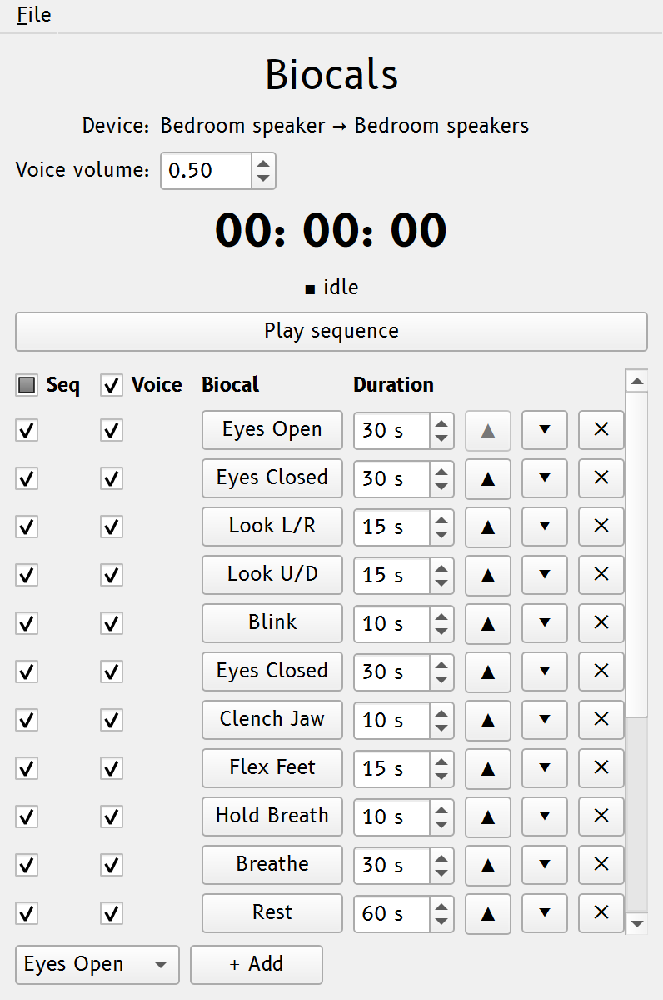

# Biocals

Sleep studies open with **biocalibrations**: scripted participant actions (eyes
open, eyes closed, look left/right, and so on) whose known physiological signatures
verify the recording channels. The **Biocals** window (in the **Panels** column)
runs them as timed, marked events — every standard biocal plus the common
lucid-dreaming signal practices (LRLR variants, fist clenches, sniffs), each on its
own row.

{#fig-biocals width=75% fig-alt="The Biocals window: the countdown and Play sequence button above the scrolling stack of biocal rows, each with Seq/Voice checkboxes and a duration."}

## Running a biocal

Each row has a toggle button, two checkboxes, and a duration:

- **The biocal's button** runs it. The button stays depressed while it runs and the
  countdown at the top shows the time remaining in its task window. Press it again
  to cancel early, so a botched 30-second window need not be waited out.
- **Voice** speaks the pre-recorded instruction (for example, *"Please close your
  eyes and relax for thirty seconds."*) over the cue output when the biocal starts.
  Leave it unchecked to give the instruction yourself.
- **Seq** includes the row when **Play sequence** runs the whole stack in order.
  Standard biocals start checked; the lucid-dreaming ones start unchecked.
- **Duration** is the task window in seconds. With the voice on, the window (and its
  countdown) starts when the instruction *ends*, so a 10-second breath hold is a
  full 10 seconds. This matches the manual practice of speaking first, then marking
  when the participant complies.

## Sequences

**Play sequence** runs every Seq-checked row top to bottom, depressing each button
as it goes. Pressing the *active* biocal's button skips that item (a cancel marker,
then on to the next); pressing the sequence button again aborts the rest. Rows can
**repeat** a biocal (eyes-closed twice, extra LRLRs — use **+ Add** for another
instance), be reordered with **▲/▼**, and removed with **✕**. The stack is locked
while something is running. For a biocal SMACC does not ship, use a custom event
button in the [Event logging panel](triggers.md#event-logging-panel).

## Markers

Each biocal's *start* code fires when its task window opens. A shared **completed**
code fires when the window runs out, and a shared **cancelled** code fires on an
early stop (the preceding start code identifies which biocal). A played sequence is
bracketed by its own start/stop codes and otherwise fires the same per-biocal
markers. The defaults are sequence start/stop **105**/**106**, cancelled **107**,
completed **108**, and one start code per biocal in the **110–126** band. All are
retunable in the **Markers** window like any built-in event (see
[Markers & port codes](triggers.md)).

## Voice recordings

Voice recordings ship inside SMACC (generated with
[ElevenLabs](https://elevenlabs.io) text-to-speech) and are read straight from the
bundle, so they stay current when you upgrade. To use another voice or language,
drop your own recording under the same name in your SMACC directory's `biocals/`
folder (for example `~/SMACC/biocals/`); a file there overrides the bundled one. A
biocal with no recording in either place still runs, just unvoiced, and session
start warns when that happens.

The shared **Voice volume** rides the cue route, so the master output cap and the
control-room monitor fan-out apply to instructions exactly as they do to cues (see
[Volume & latency](latency.md) and [Audio routing](audio.md)).
