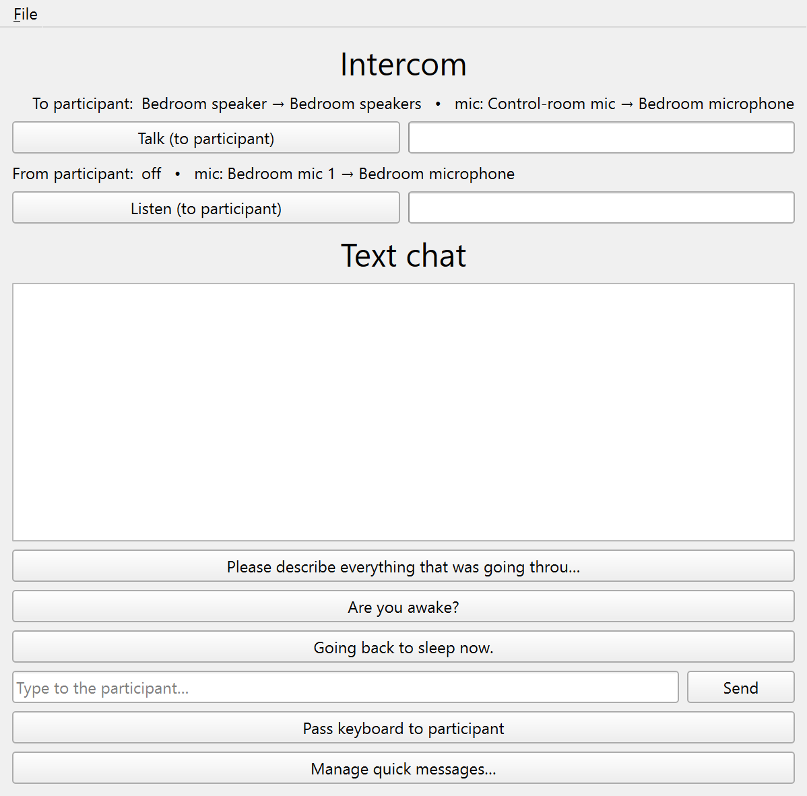
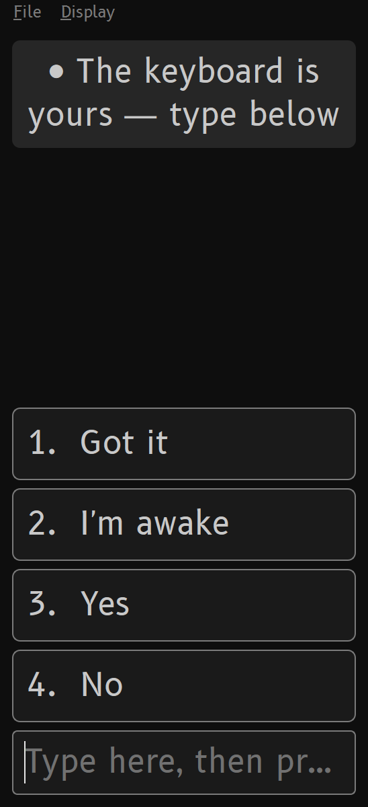

# Intercom & chat

The **Intercom** window (in the **Panels** column) is the live channel between the
control room and the bedroom. It carries voice both ways, plus a typed text channel
for when audio would intrude.

{#fig-intercom width=75% fig-alt="The Intercom window: Talk and Listen with their level meters, and the text-chat area with quick-reply buttons below."}

## Voice

- **Talk (to participant)** pipes the control-room mic to the participant's output.
  Click to latch, or hold the **spacebar** anywhere in SMACC for push-to-talk.
  Talking is marked in the EEG record.
- **Listen (to participant)** brings the bedroom mic to your control-room speakers.
  It is unmarked.

Both directions route through equipment set once in the **Devices** window (see
[Audio routing](audio.md)). A **level meter** beside each button shows the live
input level while that direction is on, so signal on the bar means audio is actually
flowing (your mic for Talk, the participant's mic for Listen) rather than just a
latched button.

## Text chat

Below the voice controls is a **typed channel**, for hearing-impaired participants,
or whenever audio would intrude or you want the exchange in writing. You type in the
Intercom panel; the participant reads and replies in a separate **Participant chat**
window built for a dark bedroom: always dark regardless of the lights toggle, large
text (default 18 pt, resize with `Ctrl+=` / `Ctrl+-`), and an optional **red night
text** mode (**Display** menu), with no flashing and no sounds.

{#fig-chat width=45% fig-alt="The Participant chat window: dark with large text, the 'The keyboard is yours' banner, and number-key quick replies."}

**Setup.** The first cut assumes one computer: extend the desktop onto a
bedroom-facing monitor and plug in a second keyboard for the participant. Click
**Pass keyboard to participant** to open the participant window, drag it onto the
bedroom display once, and it reopens there next session.

**One keyboard at a time.** Windows gives the machine a single input focus, so the
two keyboards type into whichever window is active; text chat is half-duplex, like
push-to-talk. **Pass keyboard to participant** (or `Ctrl+Enter`, which sends your
message first) activates the participant window so their keystrokes land there.
Clicking back into SMACC takes focus back. The participant window shows a banner,
*"● The keyboard is yours"* or *"○ Waiting"*, so a drowsy participant always knows
whether typing will land.

**Quick replies.** Canned messages save both sides from typing a full sentence at
3 a.m., and they travel with the study. Click **Manage quick messages…** on the
Intercom panel to edit two lists: *experimenter prompts* (one click sends a
standardized prompt, such as the lab's dream-report question or *"Are you awake?"*)
and *participant replies* mapped to the number keys **1–9** (for example *"Got it"*,
*"I'm awake"*, *"Yes"*, *"No"*). The participant's replies appear as large numbered
chips; pressing a number sends that reply, but only while their entry box is empty,
so a typed reply that contains digits still works. A sent preset is logged and
marked exactly like a typed message.

**What's recorded.** Every message is written verbatim to the session log as a
`DEBUG` line (tick *Debug* above the log preview to watch the exchange live). By
default no port codes fire and nothing reaches the BIDS events export: a typed
exchange is rapid and conversational, and would flood the marker channel. If a study
needs marker timestamps, route `Chat to participant` (code 69) and `Chat from participant` (code 70) to LSL/TTL in the **Markers** window (see
[Markers & port codes](triggers.md)). The markers stay bare, without the message
text, so the trigger channel stays legible.
