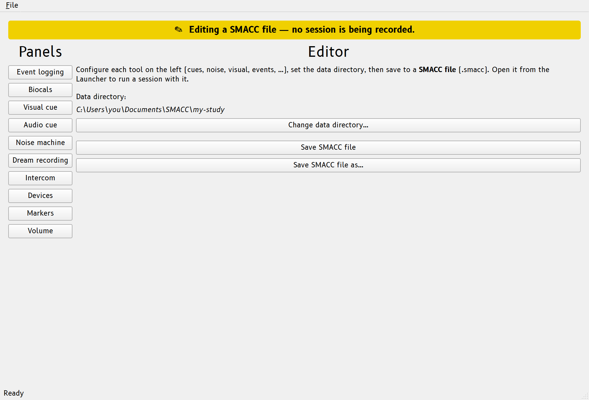

# SMACC files

A **SMACC file** (`.smacc`) is the study's configuration: cue files, volumes,
noise, visual cues, biocals, survey presets, event codes, the display choices
that apply to a session (always-on-top and log-preview levels), and the **data
directory** where runs are written. It plays the same role for a SMACC study
that a montage file plays for an EEG setup — configure it once, then reuse it
session after session.

A SMACC file is *not* a session file. It is not tied to any particular run:
opening one **starts a new session** with that configuration, and you can start
as many sessions from the same file as you like. Sessions never rewrite the
SMACC file they were started from — what happened in a run is recorded in that
run's [session log](reference/session-log.md), not in the SMACC file.

It is a single, portable file (plain YAML you can read and edit). Cue/noise
files and the data directory are stored **relative** to the SMACC file when they
sit beside it — so a self-contained study folder stays valid if you move, copy,
or zip it — and **absolute** when they point elsewhere. For the exact on-disk
format, see the [SMACC file reference](reference/settings-file.md).

<!-- Add a screenshot of the Editor here once available, e.g.:
 -->

## Creating a SMACC file

There are two ways to make one:

- **From scratch, in the Editor.** In the [Launcher](usage.md#opening-smacc),
  click **Create** to open the **Editor** on a fresh configuration (or select an
  existing SMACC file and click **Edit**). Configure each tool on the left, set
  the data directory, and **Save as…** to a new `.smacc` anywhere you like. The
  Editor never records a run — it only authors configuration.
- **From a live session.** In a running **Session**, use **File &rsaquo; Save
  SMACC file as…** to snapshot the session's *current* settings — including any
  mid-session tweaks (volumes, device routing, event-code edits) — to a new
  SMACC file. Handy when you've tuned things live and want tonight's setup to be
  tomorrow's starting point.

SMACC ships a `default.smacc` in your SMACC directory as a working example. It
is treated as a read-only template — saving over it redirects to Save-As — so
there is always a known-good configuration to fall back on.

You can keep SMACC files anywhere: for instance one per participant
(`peter.smacc`, `paul.smacc`, …) or one per protocol, each pointing at whatever
data directory you like (they can share one).

## The data directory

Every SMACC file names a **data directory** — where its runs are written. Each
session started from the file gets its own timestamped folder under that
directory (e.g. `smacc-20260607-223015/`) holding the run's `.log`,
dream-report recordings, survey responses, and any exports. Set it in the
Editor (**Change data directory…**); choose it deliberately, since it
determines where a night's data ends up.

## Opening a SMACC file

Opening a SMACC file starts a new session configured by it:

- **Double-click the file** (Windows build): SMACC launches straight into a
  Session for it. The first launch offers to set up this file association; you
  can (re)enable it any time from **File &rsaquo; Associate .smacc files
  (Windows)** in the Launcher.
- **From the Launcher**: pick the file in the **Settings** dropdown (recent
  files are listed; **Browse…** finds any other), then click **Start**.
- **From a terminal**: `SMACC path/to/file.smacc`.
