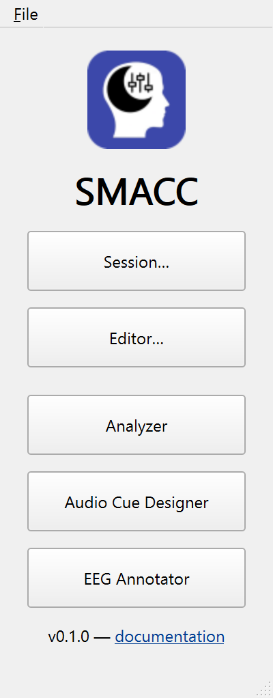
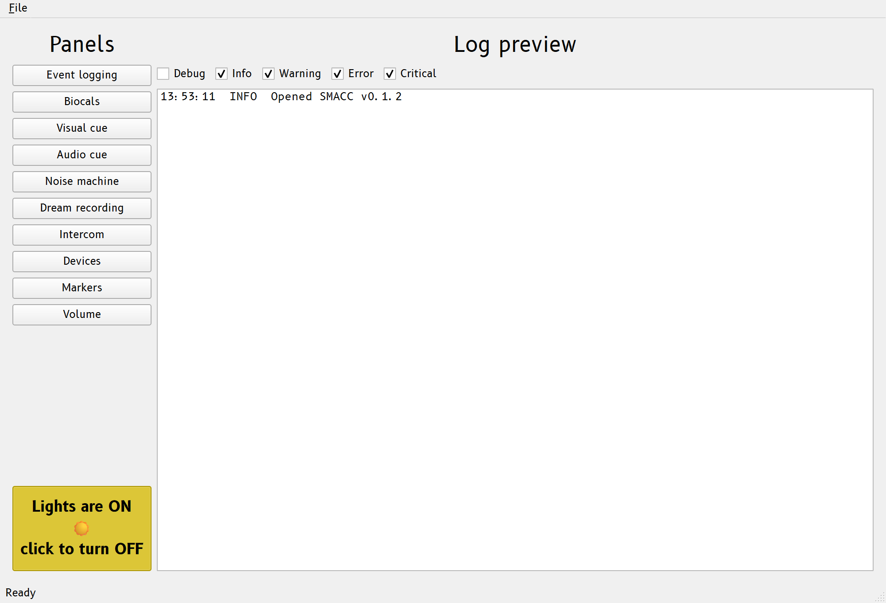
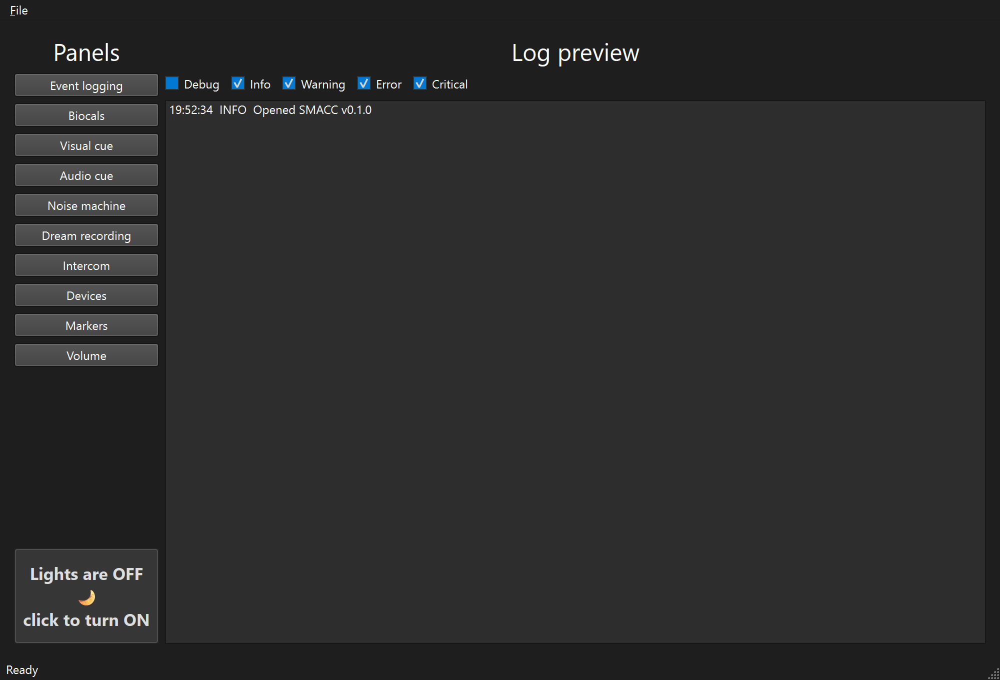

# Overview {#chap-usage}

SMACC opens to its **Launcher** — a list of the SMACC tools. Click a tool and SMACC
asks for the **SMACC file** to use, then opens it. To run a night you open a live
**Session**. This page orients you; each tool then has its own page.

The Launcher's tools (its title bar reads **SMACC**):

- **Session…** — run a live **Session** for collecting data, the interface for
  running a night. SMACC prompts for a [SMACC file](smacc-files.md#chap-smacc-files) first.
- **Editor…** — create or edit a [SMACC file](smacc-files.md#chap-smacc-files) in the **Editor**,
  without recording anything.
- **Analyzer** — inspect a past session.
- **Audio Cue Designer** — build a tone cue and export it as a WAV.
- **EEG Annotator** — review and annotate a recorded EEG (see
  [EEG Annotator](eeg-annotator.md#chap-eeg-annotator)).

The **Session** and the **Editor** are the same window in two modes — running a
night versus authoring a SMACC file.

{#fig-launcher width=45% fig-alt="The SMACC Launcher: a button per tool, with the version and a documentation link."}

## Opening SMACC

Open the app to get the Launcher. SMACC never drops straight into a session; the one
exception is double-clicking a `.smacc` file, which opens the **Start a session**
dialog with that file preselected. From the Launcher:

- **Session…** — opens the **Start a session** dialog. Pick the **SMACC file** (the
  picker lists recent files, the seeded `default`, and **Browse…** for any other),
  confirm the optional subject/session/notes, and click **OK** to start. Runs are
  written to that file's **data directory**; the run folder and log are created only
  when the session starts. (See [SMACC files](smacc-files.md#chap-smacc-files) for what a SMACC file
  holds.)
- **Editor…** — opens the **Open in the Editor** dialog. Choose **New SMACC file**
  for a blank configuration, or an existing file (recents / **Browse…**) to edit.
  The Editor configures the panels (cues, noise, visual, markers, surveys), sets a
  data directory, and saves with **Save SMACC file as…**; it never records a run.
- **Analyzer** — open a past session (a `.log`, a session folder, or a zipped
  session) to see a summary (events, duration, subject/session, dream reports),
  export its events to a BIDS `events.tsv`, or recover its settings to a `.smacc` —
  all without starting a new session.
- **Audio Cue Designer** — open the standalone tool to build a simple tone cue and
  export it as a WAV into a study's `cues/` folder (see
  [Audio cues](audio-cues.md#designing-a-cue)).
- **EEG Annotator** — open the post-hoc [EEG Annotator](eeg-annotator.md#chap-eeg-annotator) to review a
  recorded night and place annotations. It runs as its own window and process, so it
  stays available while a session runs.

Closing the Editor or a standalone tool returns you to the Launcher. Ending a
Session quits SMACC entirely — the night is over. Closing the Launcher also quits
SMACC.

## The Session window

A running Session has two columns. The **Panels** column on the left opens each tool
window (Audio cue, Visual cue, Noise machine, Dream recording, Intercom, Biocals,
Markers, Event logging, Devices, Volume). The right side is the live **Log preview**,
with checkboxes to choose which [log levels](reference/session-log.md#log-levels) it
shows. The **Lights** toggle on the main window dims the room (and flips the app's
dark theme).

Tool windows close with **Ctrl+W** (or **File › Close window**), which only hides
the window with its state intact; the session keeps running and the Panels column
reopens it.

{#fig-session width=100% fig-alt="The Session window: the Panels column opens each tool, the Log preview streams events on the right, and the Lights toggle sits at the bottom-left."}

Flip **Lights** off and the whole app switches to a dark theme for the night —
the same window, dimmed for a dark control room:

{#fig-session-dark width=100% fig-alt="The Session window with the lights off: the same layout in SMACC's dark night theme."}

## The tools

Each tool has its own page:

- [Audio cues](audio-cues.md#chap-audio-cues) — the cue board, the Audio Cue Designer, background
  noise, and confirming a cue reaches the bedroom.
- [Visual cues](visual.md#chap-visual) — light cues on a BlinkStick or Philips Hue.
- [Biocals](biocals.md#chap-biocals) — timed, marked biocalibration tasks.
- [Dream reports & surveys](surveys.md#chap-surveys) — record a report and administer a survey.
- [Intercom & chat](intercom.md#chap-intercom) — talk, listen, and a typed channel.
- [Markers & port codes](triggers.md#chap-triggers) — the Markers window, the Event logging panel,
  and EEG triggers.
- [Audio routing](audio.md#chap-audio) and [Devices](devices.md#chap-devices) — bind equipment and route
  actions to it.
- [Volume & latency](latency.md#chap-latency) — the output safety cap and stimulus timing.

## Event log

Every run writes a detailed `.log` to its own timestamped folder under the SMACC
file's **data directory** (for example `~/SMACC/data/`), capturing the events and
settings for that session. Open one later from the Launcher's **Analyzer** to see a
summary, export its events to BIDS, or recover its settings. For the line format and
levels, see the [session log reference](reference/session-log.md#chap-reference-session-log). If SMACC crashes,
see [Troubleshooting](troubleshooting.md#if-smacc-crashes).

## Display preferences

Some display choices apply to a session and travel with the study in the SMACC file:
**always-on-top** (toggled per window — the Session window's **File** menu, each tool
window's **File** menu, or **Ctrl+T** in whichever window is active) and which **log
levels** show in the preview (the checkboxes above the log preview). Save them with
the rest of the configuration from the Editor, or with **File › Save SMACC file
as…** in a Session.

Separately, the machine remembers window positions and sizes and your recent files
in `~/SMACC/preferences.yaml`, restored on the next launch (see the
[preferences reference](reference/preferences-file.md#chap-reference-preferences-file)).

## SMACC files

A **SMACC file** captures your study's whole configuration — cue files, volumes,
noise, visual cues, survey presets, event markers, display choices, and the **data
directory** where runs are written — in a single portable `.smacc`. See
[SMACC files](smacc-files.md#chap-smacc-files) for the full story, and the
[SMACC file reference](reference/settings-file.md#chap-reference-settings-file) for the on-disk format.
